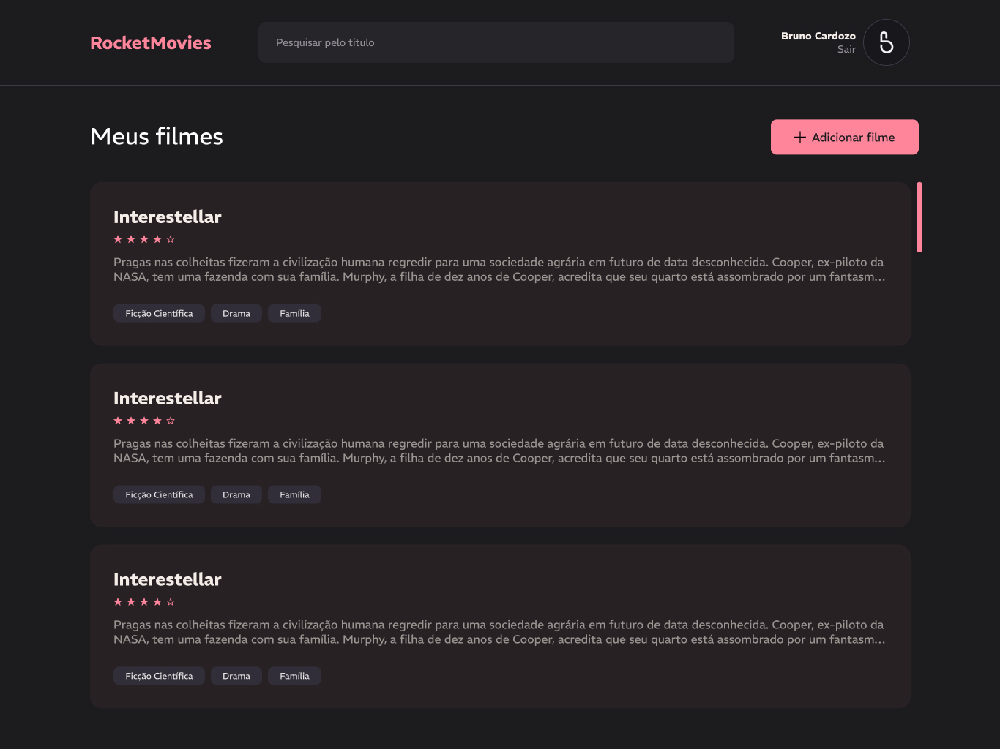
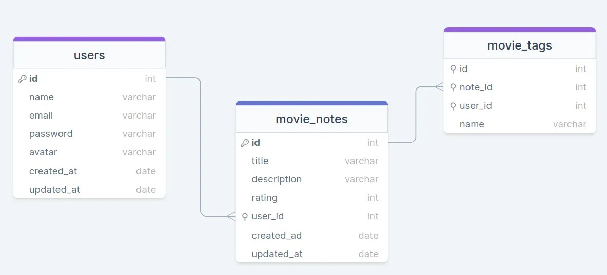

  

# RocketMovies

This is a fullstack web application built with React for the frontend and Node.js for the backend, using JavaScript throughout. The app allows users to register movies by providing details such as name, description, rating, and tags. Users can easily categorize and manage their movie collection.

Features:
- Add Movies: Users can input movie name, description, and rating.
- Tagging System: Create and associate tags with movies to organize them.

### ERD

## Tech Stack

## Prerequisites

- pnpm
- node 22+

## Getting Started

1. **Install Dependencies**: `cd /api && pnpm i` and `cd /web && pnpm i`.
2. **Environment variables**: Copy `.env.example` to a new `.env` file.
3. **Start Developing**: `cd /api pnpm dev` and `cd /web && pnpm dev`.

## Contribute

1. **Clone project**: `git clone https://github.com/bruno-c-p/rocket-movies`
2. **Create feature/branch**: `git checkout -b feature/NAME`